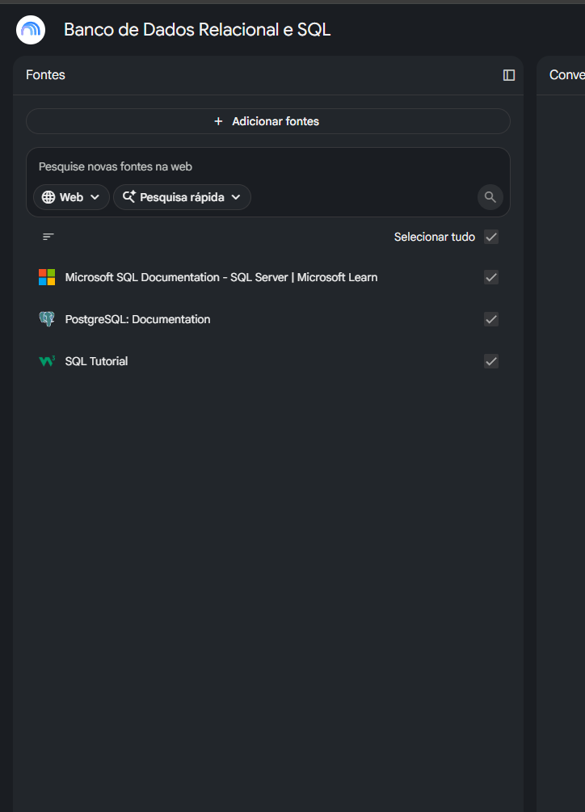
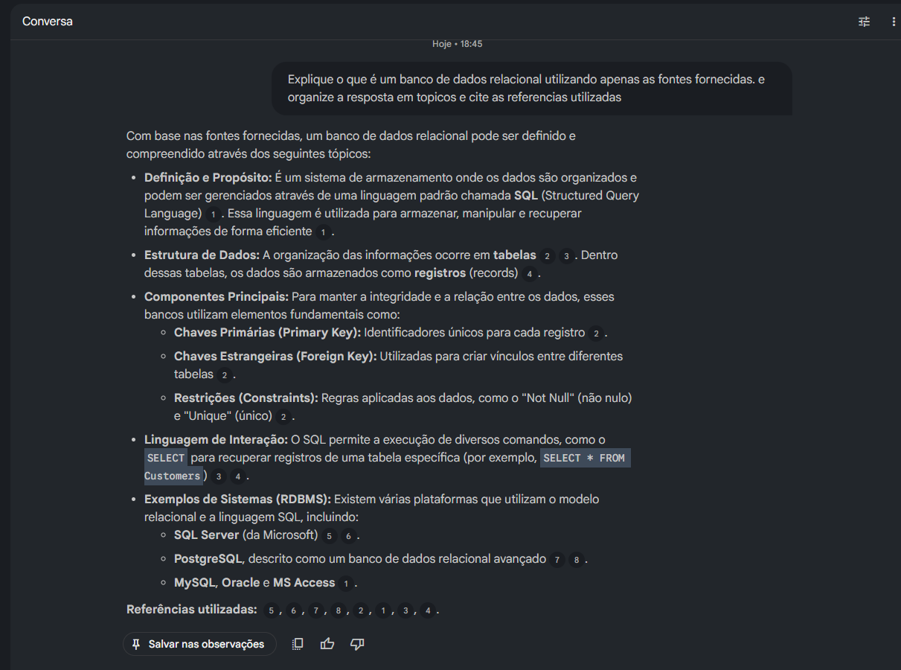
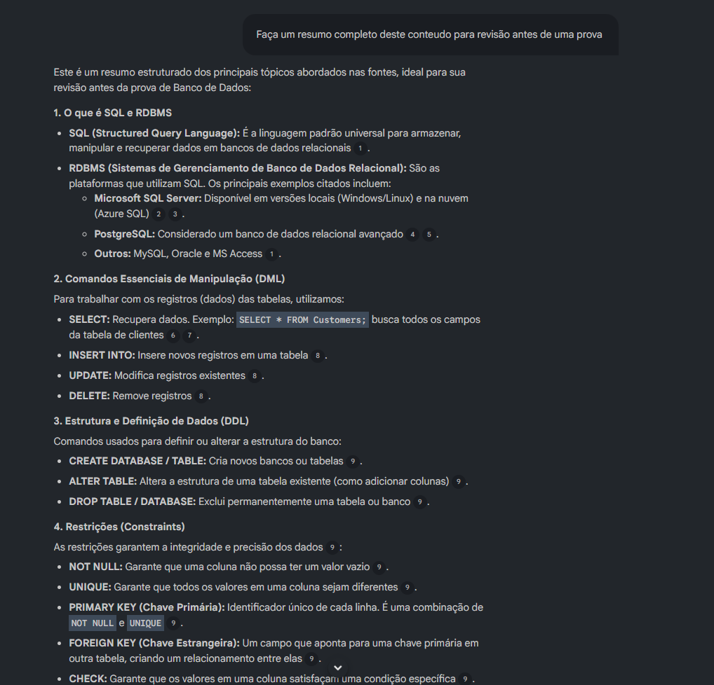
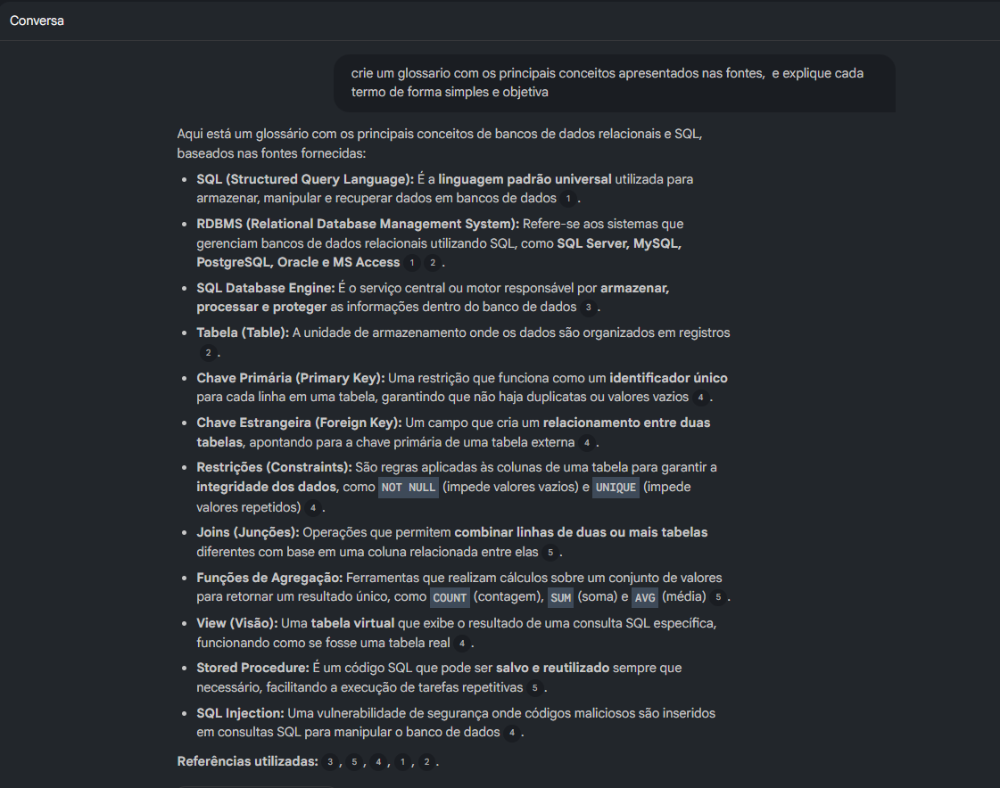
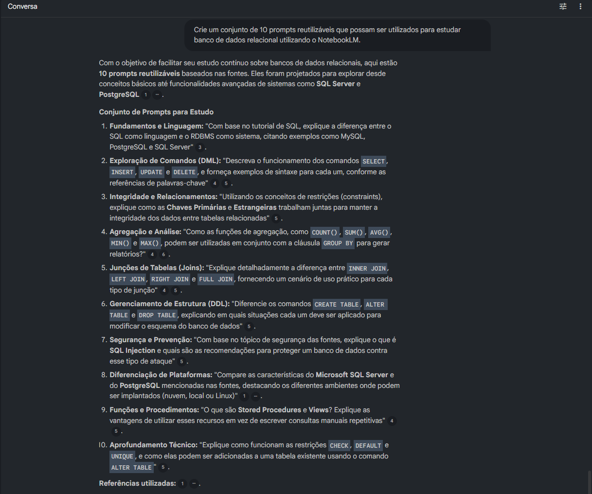

# 📷 Evidências de Utilização

Durante o desenvolvimento deste projeto foram realizados testes no NotebookLM utilizando diferentes estratégias de prompts para compreender melhor os conceitos de Banco de Dados Relacional e SQL.

---

## 📚 Fontes adicionadas ao NotebookLM

As fontes utilizadas foram:

- Microsoft Learn (SQL Documentation)
- PostgreSQL Documentation
- W3Schools SQL Tutorial

---

## 🧠 Prompt 1 – Conceito de Banco de Dados Relacional

Foi solicitado ao NotebookLM que explicasse o conceito de Banco de Dados Relacional utilizando apenas as fontes carregadas.

---

## 📝 Resumo para Revisão

O NotebookLM gerou um resumo estruturado dos principais conceitos, facilitando a revisão do conteúdo antes de provas ou entrevistas.

---

## 📖 Glossário

Foi criado um glossário com os principais termos estudados, permitindo uma consulta rápida aos conceitos fundamentais.

---

## 💡 Prompts Reutilizáveis

Também foram elaborados prompts reutilizáveis para futuras sessões de estudo utilizando o NotebookLM.

## 👨‍💻 Autor

**Lucas Silva**

Estudante de Ciência da Computação e entusiasta da área de Tecnologia da Informação.

Este projeto foi desenvolvido durante o desafio da Digital Innovation One (DIO), explorando o NotebookLM como ferramenta de apoio à aprendizagem.
